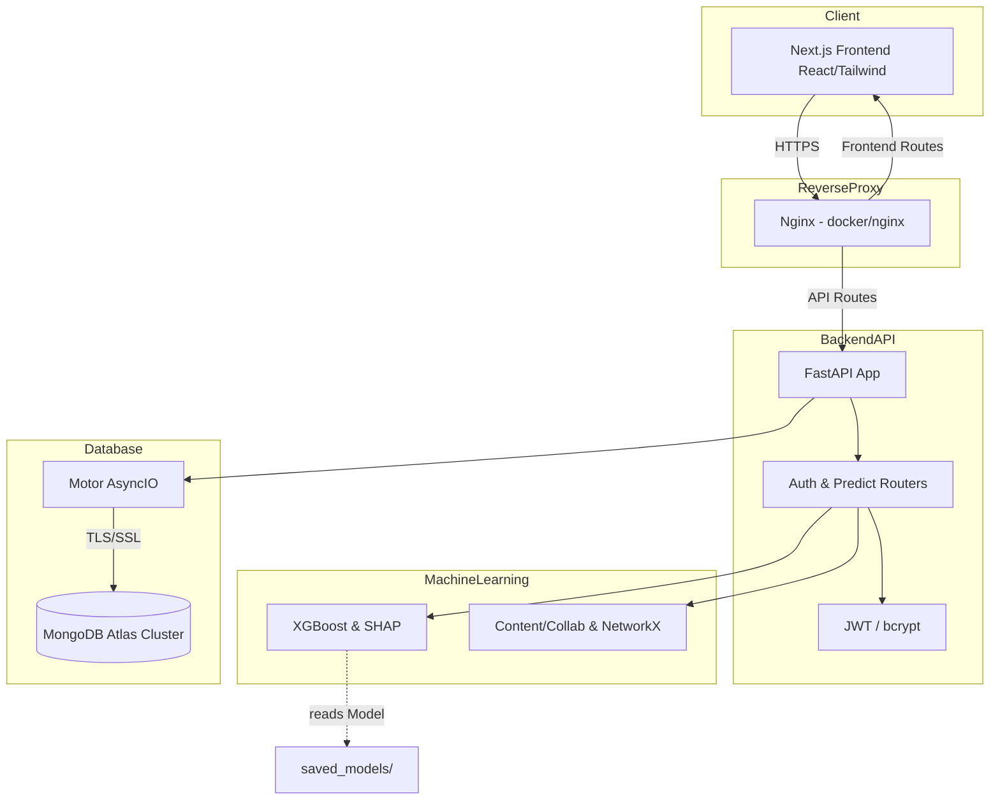

# System Architecture

```mermaid
graph TD
    subgraph Client
        Browser[Next.js Frontend React/Tailwind]
    end

    subgraph ReverseProxy
        NginxProxy[Nginx - docker/nginx]
    end

    subgraph BackendAPI
        FastAPI[FastAPI App]
        Routers[Auth & Predict Routers]
        Security[JWT / bcrypt]
        
        FastAPI --> Routers
        Routers --> Security
    end

    subgraph MachineLearning
        Predictor[XGBoost & SHAP]
        Recommender[Content/Collab & NetworkX]
    end

    subgraph Database
        MotorDriver[Motor AsyncIO]
        MongoDB[(MongoDB Atlas Cluster)]
    end

    %% Flow
    Browser -- HTTPS --> NginxProxy
    NginxProxy -- API Routes --> FastAPI
    NginxProxy -- Frontend Routes --> Browser
    
    Routers --> Predictor
    Routers --> Recommender
    
    Predictor -. reads Model .-> LocalFiles[saved_models/]
    
    FastAPI --> MotorDriver
    MotorDriver -- TLS/SSL --> MongoDB
```
