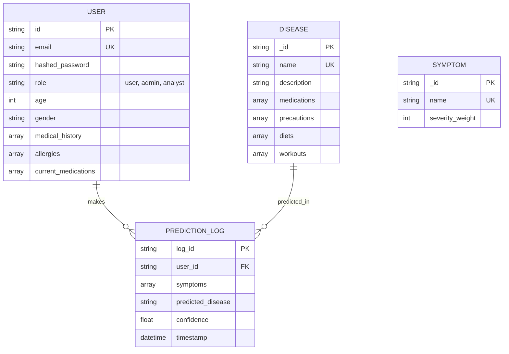

# Entity Relationship Diagram

```mermaid
erDiagram
    USER {
        string id PK
        string email UK
        string hashed_password
        string role "user, admin, analyst"
        int age
        string gender
        array medical_history
        array allergies
        array current_medications
    }

    DISEASE {
        string _id PK
        string name UK
        string description
        array medications
        array precautions
        array diets
        array workouts
    }

    SYMPTOM {
        string _id PK
        string name UK
        int severity_weight
    }

    PREDICTION_LOG {
        string log_id PK
        string user_id FK
        array symptoms
        string predicted_disease
        float confidence
        datetime timestamp
    }

    USER ||--o{ PREDICTION_LOG : "makes"
    DISEASE ||--o{ PREDICTION_LOG : "predicted_in"
```
